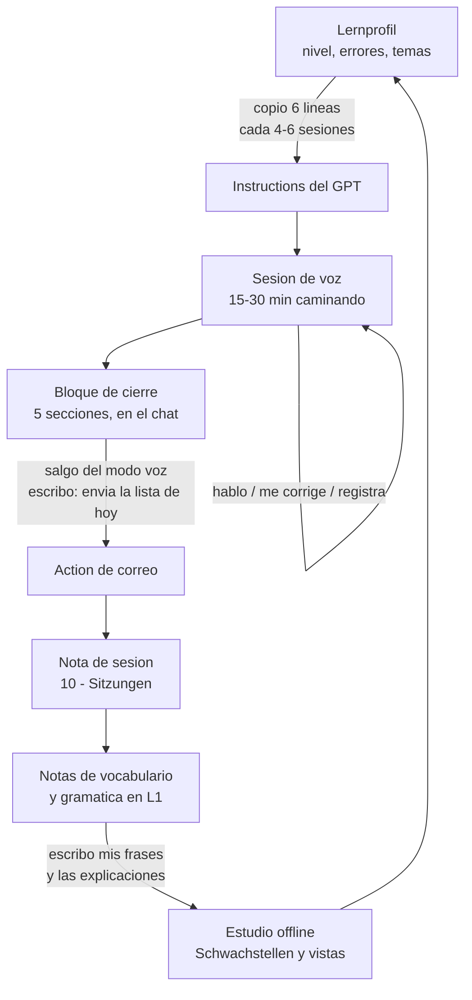

# Workflow completo

Tres etapas y una dirección: hablo, se escribe, lo proceso. Nada fluye hacia
atrás por sí solo. **El único punto donde el ciclo se cierra es a mano**, cuando
copio seis líneas del [[Lernprofil]] a las Instructions del GPT. Ese es el diseño,
no una carencia: el tutor no lee la bóveda, así que la bóveda no puede mentirme y
él no puede inventarse mi historial.



## Quién hace qué

| Etapa | El tutor | Yo | Obsidian |
|---|---|---|---|
| Sesión de voz | me hace hablar, corrige, **registra todo** | hablo | nada |
| Cierre | escribe el bloque, llama a la Action | salgo del modo voz y lo pido | nada |
| Procesado | nada | creo las notas, cruzo los errores | plantillas y vistas |
| Ejemplos | nada | **los escribo yo** | `Ohne Beispiel` los delata |
| Estudio | nada | repaso | las vistas deciden qué |
| Memoria | ninguna | copio los valores al prompt | el Lernprofil es la verdad |

Resumen honesto: el tutor produce **una sola cosa**, el bloque. Obsidian no
rellena nada, solo da forma y muestra. Todo lo demás lo hago yo.

---

## 1. Antes de salir

Nada obligatorio. Dos cosas que valen los treinta segundos que cuestan:

- Mirar [[Schwachstellen.base|Schwachstellen]]. Si hay algo con `error_count`
  alto, puedo pedirlo al empezar: *"repasa mis errores"* salta el turno 1 y va
  directo.
- Si han pasado 4-6 sesiones desde la última vez, actualizar el prompt → §7.

## 2. La sesión de voz

15-30 minutos caminando. Abro el GPT desde el acceso directo de la pantalla de
inicio, no navegando menús.

**Lo que hace él, sin que yo se lo pida:**

- Turno 1: saludo corto y **tres temas numerados**, para que pueda contestar con
  un número mientras ando. Salta los que estén en *recent themes*.
- Me pide producir a **A12** y me habla a **A22**. El desfase es deliberado.
- Introduce **6-10 palabras nuevas en voz alta**, nunca más, y siempre en
  contexto. Y **1-2 reglas de gramática**, usándolas él varias veces antes de
  pedirme que las use.
- **Recicla a propósito** el vocabulario y las estructuras que llevo en el bloque
  *Learner values*. Si reaparece un error de mi lista, trabaja ese día en él.
- Corrige en el momento solo lo que impide entender; el resto lo acumula y lo
  repasa cada 5-6 intercambios. **Registra todos los errores, también los que no
  menciona.**
- No me da la razón: ningún "Genau" ni "Super" como apertura, y nada de
  confirmar frases a medias.

**Lo que puedo decir en cualquier momento:**

`warte` (que se calle) · `protokoll fertig` (solo contesta cuando digo `fertig`) ·
`wiederhole` · `langsamer` · `auf Spanisch` · `was bedeutet ...` ·
`anderes Thema` · `einfacher` / `schwieriger`

Y para el móvil, no para el prompt: **Voice Isolation** en el Centro de Control y
auriculares. El corte a media frase es de la app, no del tutor.

## 3. Del chat al correo

Digo que termino. Él dice en voz alta cuántas palabras y reglas hemos visto, una
frase de ánimo, y que la lista está escrita en el chat. **Nunca lee la lista en
voz alta.** Si alguna estructura cumple el criterio de promoción, lo propone aquí.

Después escribe **el bloque de cinco secciones** en el chat → [[E-Mail-Format]].

Las Actions no funcionan en voz. Así que **salgo del modo voz y escribo en ese
mismo chat: "envía la lista de hoy"**. Entonces sí llama a la Action, con asunto
`Deutsch YYYY-MM-DD`. En un chat nuevo no hay bloque que reutilizar: habría que
pegarlo.

## 4. Procesar: correo → bóveda

El mismo día. Veinte minutos de atraso está bien; una semana significa que las
notas no se escriben nunca. Detalle completo en [[Verarbeitung]].

1. **Nota de sesión** `10 - Sitzungen/YYYY-MM-DD` desde `V - Sitzung`, con el
   bloque crudo pegado bajo *Roh*. Es la procedencia: si una nota luego parece
   mal, el original está ahí.
2. **VOCAB** → una nota por palabra en `20 - Wortschatz/L1`, `source:
   voice-session`. Los verbos van con `V - Verb` (conjugación y régimen); el resto
   con `V - Wortschatz`. Las dos escriben `type: vocab`.
3. **EXTRA** → igual, pero `source: tutor-extra`. Son las palabras que el tutor
   añadió y que no dije.
4. **GRAMMAR** → crear **o actualizar** en `30 - Grammatik/L1`. Las reglas
   reaparecen entre sesiones: buscar antes de crear.
5. **ERRORS** → localizar la nota a la que pertenece cada error, poner
   `last_error` a hoy, subir `error_count`, `status: learning`. Si no existe la
   nota, crearla: un error es prueba de que el elemento importa.
6. **Lernprofil** → errores recurrentes, temas recientes, promociones propuestas.

> El paso 5 es el que paga el esfuerzo. Todo lo demás registra lo que pasó; el
> paso 5 es lo que convierte la bóveda en un sistema de repaso.

Commit y push: los hace `obsidian-git` solo, cada diez minutos.

## 5. Lo que solo puedo hacer yo

**Las frases de ejemplo.** Es el único trabajo del sistema que no se delega, y no
por pereza de nadie: escribir la frase *es* el ejercicio. Una frase que me
escriban es una nota que he leído; una frase mía es una palabra que he usado.

Los dos bloques piden cosas distintas:

- **VOCAB** → la frase es un **recuerdo**. Lo que estaba diciendo cuando salió la
  palabra. Es lo único de la sesión que no se puede reconstruir después.
- **EXTRA** → la frase es un **ejercicio**. No dije esa palabra: escribirla es la
  primera vez que la uso.

**Las explicaciones de gramática** también, mientras la sesión está fresca. Una
etiqueta desnuda como *"Dativ mit in"* no me dirá nada en tres semanas.

## 6. Estudio offline

Cada vista contesta una pregunta distinta. No hay que mirarlas todas:

| Cuándo | Vista | Qué hago |
|---|---|---|
| Siempre que estudie | [[Schwachstellen.base\|Schwachstellen]] | lo que fallo. **Es mi cola de repaso.** |
| Al procesar | [[Ohne Beispiel.base\|Ohne Beispiel]] | escribir las frases que dejé pendientes |
| Antes de una sesión | [[Nicht gesprochen.base\|Nicht gesprochen]] | palabras que el tutor me dio y nunca he usado. Meterlas hoy. |
| Al empezar un tema | [[Aktuelles Niveau.base\|Aktuelles Niveau]] | qué llevo en L1 |
| Cuando me apetezca | [[Nicht in Anki.base\|Nicht in Anki]] | exportar a repetición espaciada |

`Nicht gesprochen` es la que cierra el círculo del bloque EXTRA: palabras
regaladas sin límite se convierten en deberes que nunca hago. Cuando uso una en
una sesión, la paso a `learning` y desaparece de la vista.

Para el drill: `anki: false` y exportar `term` + `translation` a CSV, o usar el
plugin de repetición espaciada que ya está instalado. Un chat es mal
entrenador y buen interlocutor; que cada uno haga su trabajo.

## 7. Cómo el tutor "recuerda"

**No recuerda.** Un GPT no usa memoria guardada ni conversaciones anteriores:
cada sesión empieza amnésica. Lo que parece memoria es un bloque de seis líneas
que yo copio a mano.

Cada 4-6 sesiones, en la web, abro el GPT y actualizo *Learner values* desde el
[[Lernprofil]]:

```
Level token: L1
Production: A12. Comprehension: A22.
Consolidated: ...
Seen, not consolidated: ...
Mistakes to watch: ...
Recent themes to avoid: ...
```

Eso es todo lo que sabe de mí, y es lo que hace que **recicle lo que ya vimos en
vez de darme material nuevo cada día**. Sin actualizarlo, el tutor sigue
funcionando perfectamente en el nivel del día que lo configuré, y no avisa: es el
fallo silencioso del diseño.

**Presupuesto:** las Instructions no admiten más de 8000 caracteres. El bloque va
por 7742, y las seis líneas volátiles tienen 534 de margen. Cuando desborden, se
recorta ahí —tres errores, dos temas— **nunca en las reglas**. Detalle en
[[GPT-Anweisungen]].

## 8. Subir de nivel

El nivel es **mi escala**, no CEFR → [[Niveaus]].

> Paso de `L1` a `L2` cuando tengo **cinco estructuras en Consolidado** y
> **`Schwachstellen` no contiene nada con `error_count` mayor que 2**.

Una estructura entra en *Consolidado* cuando la produzco correctamente, sin que me
la pidan, en tres sesiones distintas. El tutor propone las promociones en su
cierre, porque él ha estado escuchando y yo no he tomado notas.

Cuando toque, cuatro sitios a mano:

1. Crear `20 - Wortschatz/L2` y `30 - Grammatik/L2`.
2. En `Aktuelles Niveau.base`, cambiar `note.level == "L1"` por `"L2"`.
3. En el [[Lernprofil]]: `active_level`, y sobre todo **el par de calibración
   CEFR** — es lo que hace que el tutor empiece a exigirme más.
4. En el GPT: `Level token`, los dos niveles, y la línea `level: L2` del bloque.

**Las notas viejas no se mueven.** `L1` es el registro histórico de lo que aprendí
ahí, no una etiqueta de dificultad que haya que mantener al día.

---

## Cadencia

| Cuándo | Qué |
|---|---|
| Cada sesión | hablar, pedir el resumen, pedir el correo, procesar el mismo día |
| Al procesar | mis frases de ejemplo y mis explicaciones de gramática |
| Cada semana | releer el log de errores: ese es el currículo de la semana siguiente |
| Cada 4-6 sesiones | actualizar *Learner values* en el GPT. Dos minutos |
| Al promocionar | los cuatro pasos de §8 |
| Cuando apetezca | exportar a repetición espaciada |

## Los cinco fallos silenciosos

Ninguno da error. Todos degradan el sistema sin avisar.

1. **No actualizar el prompt.** El tutor se queda congelado en el nivel de hace un
   mes y no lo dice.
2. **Saltarse el paso 5** (cruzar los errores). La bóveda se convierte en un
   archivo de cosas que nunca repaso. Síntoma: `Schwachstellen` vacío después de
   cinco sesiones.
3. **Dejar los ejemplos en blanco.** Síntoma: `Ohne Beispiel` creciendo.
4. **Acumular EXTRA sin usarlo.** Síntoma: `Nicht gesprochen` creciendo.
5. **Escribir un nivel o una clave distinta** — `L 1`, `l1`, renombrar un campo
   del frontmatter. La vista deja de ver la nota y **no avisa**.
