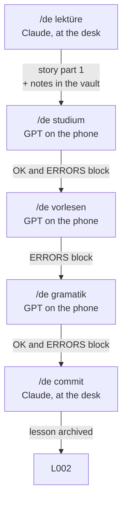

# The lesson cycle

> `{TARGET}` = German · `{KNOWN}` = Spanish · `{LEARNER}` = Pedro → [[Configuration]]

A lesson is a unit of five gated phases: `L001`, `L002`… Each phase is launched
with a command, and each command checks that the previous one has been passed.
That is what turns five tools into a lesson.

## Who does what now

| | Before | Now |
|---|---|---|
| Source of truth | the vault, hand-copied into the prompt | **the vault, read live by Claude** |
| Generates the prompts | the learner, by hand, every 4-6 sessions | **Claude, every lesson** |
| ChatGPT | a tutor with hand-copied memory | **only the voice on the phone** |
| *Learner values* | six lines that went stale silently | **does not exist** |

**That last row is the biggest win.** The recurring cost of the system used to be
keeping a six-line block inside the prompt in sync; forget it and the tutor kept
working at last month's level without saying so. With the prompt generated from
the vault every lesson, there is no copy left to go stale.

## The five phases

### 1. `/de lektüre` — Claude, at the desk

**Spec: [[Kommando - Lektüre]].**

Read the vault: which words are already there, what gets failed, which themes have
been used. Ask for a theme. Write a **story with characters** in two parts and
hand over the first, which is where the new nouns, verbs, adjectives, expressions
and grammar come in. Create the notes with their `lektion` and `cefr`, and store
the story in the lesson note.

If the theme has been used before, that is taken into account so the lesson brings
something new instead of repeating.

### 2. `/de studium` — GPT on the phone

**Spec: [[Kommando - Studium]].** Prompt template: 5319 fixed characters, ~1050
for a list of 17 items, **6349 in total**.

Check phase 1 is done. Generate the **Studium** GPT prompt with the lesson's
vocabulary, already shuffled and numbered, to be pasted over the existing GPT's
Instructions. Three modes: `Sequenz`, `Frage auf Deutsch`, `Frage auf Spanisch`.

**The 70/30.** The vocabulary in the prompt is not only the lesson's: **70% from
the current lesson, 30% from `Schwachstellen` and never-produced words of earlier
lessons.** Without that, every lesson is a closed bucket and the system learns
well and retains badly — the classic failure of unit-based methods. It costs the
learner nothing, because the prompt is generated here.

**And the random order is shuffled here**, once, and numbered inside the prompt. A
model cannot hold a shuffled list across turns: it loses it and repeats. With the
list fixed, `vorherige` actually works.

### 3. `/de vorlesen` — GPT on the phone

**Spec: [[Kommando - Vorlesen]].** 5666 fixed plus the text and the questions,
**~7575 in total**. The tightest of the three.

Check phases 1 and 2. Write **part 2 of the story** — same characters, **no new
vocabulary** — and put it literally inside the prompt. The GPT starts by reading
it aloud.

Having the text fixed in the Instructions has an advantage an improvised text did
not: **`noch einmal` repeats exactly the same words**, instead of depending on the
model remembering what it made up.

Then `frag` asks questions about the story, **answered in `{TARGET}`**, with strict
correction of vocabulary, grammar and pronunciation. `nächste` moves on.

> **The text is never written in the chat.** If it is written it gets read, and
> reading is not this phase. Part 1 was already read on a screen; this one is by ear.

### 4. `/de gramatik` — GPT on the phone

**Spec: [[Kommando - Gramatik]].** 5532 fixed plus the rule and the sentences,
**~6800 in total**. The roomiest of the three.

Check phases 1, 2 and 3. Generate a GPT with sentences in `{KNOWN}` containing the
lesson's grammar. They get translated aloud; it corrects; repeat; it corrects
again. `nächste` moves to another.

**With an exit after three attempts.** *"Until the sentence comes out right"* can
fail to terminate, and a stuck sentence makes you abandon the session: on the third
attempt it gives the sentence, logs the error and moves on.

### 5. `/de commit` — Claude, at the desk

**Spec: [[Kommando - Commit]].** **All five phases are specified.**

Check all four. Process any outstanding blocks, run the vault health check, commit,
mark the lesson `closed` and **archive it, do not delete it**: it is what will tell
you, six months from now, which story taught you `Bahnsteig`.

## Gates are proven with evidence

A passed phase is not a box that gets ticked: it is **its closing block**.

Phases 2, 3 and 4 end by emitting the block in the chat, and the GPT mails it with
the Make Action. It gets pasted back when the next command is launched. No block,
no passed phase.

That solves two things at once: the gate checks something real, and **spoken errors
enter the vault**. Without the block there would be three practice phases that
record nothing, `Schwachstellen` empty forever, and four gates guarding a progress
nobody measures.

| Phase | Emits | Why |
|---|---|---|
| 1. Lektüre | nothing, the notes are written directly | Claude is in the room |
| 2. Studium | `OK` + `ERRORS` | it is retrieval: there are hits and misses |
| 3. Vorlesen | `ERRORS`, including `comprehension` | no `VOCAB`: nothing new enters |
| 4. Gramatik | `OK` + `ERRORS` | same as Studium |

Format in [[E-Mail-Format]]. The `OK` block is still the only exit from
[[Schwachstellen.base|Schwachstellen]].

## `cefr` and `lektion` are different things

This is the one thing never to confuse:

- **`cefr: A12`** is **the difficulty of the word** on the international scale. It
  is a property of the vocabulary, not of the learner, and it **decides the
  folder**. Twelve closed tokens: `A11 A12 A21 A22 B11 B12 B21 B22 C11 C12 C21 C22`.
- **`lektion: L001`** is **when it entered the vault**. A field, never a folder:
  the sequence has no ceiling, and one folder per lesson would be fifty
  directories of a dozen words a year.

There is no `level` field any more. Having one meant two things called level, and
that is what broke the views in August. See [[Niveaus]].

**What was lost by removing it, plainly:** the promotion criterion. With lessons,
"progress" comes to mean how many have been done, which is activity and not
ability. `status: known` per item and `Schwachstellen` still measure mastery, so
nothing goes blind. But if a definition of *I have improved* is missed three months
from now, this is what is missing.

## What this cycle retired

The whole earlier "modes" architecture — `Modi`, `Modus - Hören`,
`Modus - Wiederholung` and `Export - Wiederholung` — was deleted on 2026-09-07,
once all five phases were specified. `Studium` does the drilling with fresh data
and no file to regenerate; `Vorlesen` replaces the listening mode and improves on
it, because the text is fixed.

**[[Modus - Sprechen]] survives**, outside the cycle. Free conversation while
walking is none of the five phases and is the only thing that is genuinely
conversation. It stays a permanent GPT with its own prompt and its own
`mode: sprechen` block, and its sessions still live in `10 - Sitzungen`.

## The health check lives in phase 5

`/de commit` is the only moment in the cycle that looks at the whole vault **after
everything has happened**, so it is where the failures that raise no error get
caught: invalid `cefr` tokens, folders that do not match their field, broken links,
`.base` files that do not parse — and the two numbers that matter,
`Schwachstellen` growing with nothing reaching `known`, and `Nicht gesprochen`
growing lesson after lesson. Detail in [[Kommando - Commit]].

## The prompts are saved

All three generated prompts go inside the lesson note, in their `## Prompt - *`
sections. **They are not reproducible**: the Studium shuffle is random, and the
story and the sentences are generated fresh each time. If a GPT behaves oddly, the
exact pasted prompt is the only thing that makes it possible to find out why.

Saving the Vorlesen one does not contradict the transcript rule: the note is
provenance and gets read at the desk, not during the listening session.

## How it is implemented

The commands are a **skill** called `de`, which is only a **router**: it validates
the phase, reads the state in `10 - Lektionen/`, checks the gate, and then reads the
phase's specification in `50 - Ressourcen/Kommando - *.md` and follows it.

**The logic lives in the vault, not in the skill.** To change how the story gets
written or how many words come in, edit [[Kommando - Lektüre]] in Obsidian. That is
consistent with the vault being the source of truth: it is the source of truth for
how the system works, not only for what has been learned.

If a specification does not exist, the skill says so and stops. It does not
improvise a version.

## Status

| Lesson | Theme | Phases | Notes |
|---|---|---|---|
| [[L001]] | `wohnen` | 1 of 5 | reconstructed retroactively, did not follow the flow |

**L002 will be the first real lesson.**
