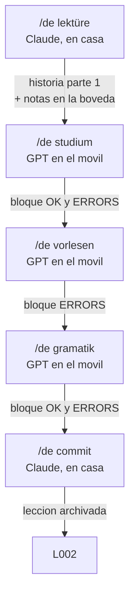

# El ciclo de lecciones

Una lección es una unidad de cinco fases con puerta: `L001`, `L002`… Cada fase se
lanza con un comando, y cada comando comprueba que la anterior está superada. Eso
es lo que convierte cinco herramientas en una lección.

## Quién hace qué, ahora

| | Antes | Ahora |
|---|---|---|
| Fuente de verdad | la bóveda, copiada a mano al prompt | **la bóveda, leída en vivo por Claude** |
| Genera los prompts | yo, a mano, cada 4-6 sesiones | **Claude, cada lección** |
| ChatGPT | tutor con memoria copiada | **solo la voz en el móvil** |
| *Learner values* | seis líneas que envejecían en silencio | **no existe** |

**Ese último punto es el que más gana.** El coste recurrente del sistema era
mantener sincronizado un bloque de seis líneas dentro del prompt; si se me
olvidaba, el tutor seguía funcionando en el nivel del mes pasado sin avisar. Al
generarse el prompt desde la bóveda en cada lección, no hay copia que envejecer.

## Las cinco fases

### 1. `/de lektüre` — Claude, en casa

**Especificación: [[Kommando - Lektüre]].** Escrita.

Leo la bóveda: qué palabras ya tengo, qué fallo, qué temas he hecho. Pregunto el
tema. Escribo una **historia con personajes** en dos partes y te doy la primera,
que es donde entran los sustantivos, verbos, adjetivos, expresiones y gramática
nuevos. Creo las notas con `lektion: L001` y su `cefr`, y guardo la historia en la
nota de lección.

Si el tema ya lo hiciste, lo tengo en cuenta para meter cosas nuevas en vez de
repetir.

### 2. `/de studium` — GPT en el móvil

**Especificación: [[Kommando - Studium]].** Escrita. Plantilla del prompt: 5319
caracteres fijos, ~1050 la lista de 17 elementos, **6349 en total**.

Compruebo que la fase 1 está hecha. Genero el prompt del GPT **Studium** con el
vocabulario de la lección, ya barajado y numerado, y tú lo pegas sobre las
Instructions del GPT existente. Tres modos: `Sequenz`, `Frage auf Deutsch`,
`Frage auf Spanisch`. Comandos: `noch einmal`, `wiederhole`, `vorherige`,
`nächste`, y en Sequenz también `Spanisch`.

**El 70/30.** El vocabulario que va al prompt no es solo el de la lección: **70%
de la lección actual y 30% de `Schwachstellen` y palabras sin estrenar de
lecciones anteriores.** Sin eso, cada lección es un cubo cerrado y el sistema
aprende bien y retiene mal, que es el fallo clásico de los métodos por unidades.
No te cuesta nada porque el prompt lo genero yo.

**Y el orden aleatorio lo barajo yo**, una vez, y va numerado dentro del prompt.
Un modelo no puede mantener una lista barajada entre turnos: la pierde y repite.
Con la lista fija, `vorherige` funciona de verdad.

### 3. `/de vorlesen` — GPT en el móvil

*Especificación pendiente: `Kommando - Vorlesen`.*

Compruebo las fases 1 y 2. Escribo la **parte 2 de la historia** —mismos
personajes, **sin vocabulario nuevo**— y la meto literalmente dentro del prompt.
El GPT empieza leyéndotela.

Que el texto esté fijo en las Instructions tiene una ventaja que no tenía el modo
Hören: **`noch einmal` repite exactamente lo mismo**, en vez de depender de que el
modelo recuerde lo que improvisó.

Después, `frag` te hace preguntas sobre la historia y **contestas en alemán**, con
corrección estricta de vocabulario, gramática y pronunciación. `nächste` pasa a la
siguiente.

> **El texto no se escribe nunca en el chat.** Si está escrito, lo lees, y leer no
> es esta fase. La parte 1 ya la leíste en pantalla; esta es de oído.

### 4. `/de gramatik` — GPT en el móvil

*Especificación pendiente: `Kommando - Gramatik`.*

Compruebo las fases 1, 2 y 3. Genero un GPT con frases en español que contienen la
gramática de la lección. Las traduces hablando; corrige; repites; corrige. Con
`nächste` pasas a otra.

**Con una salida a los tres intentos.** "Hasta que la diga correctamente" puede no
terminar nunca, y una frase atascada te hace abandonar la sesión: al tercer
intento te da la frase, la registra como error y pasa a la siguiente.

### 5. `/de commit` — Claude, en casa

*Especificación pendiente: `Kommando - Commit`.*

Compruebo las cuatro. Proceso los bloques que falten, hago commit, marco la
lección `closed` y **la archivo, no la borro**: es lo que dentro de seis meses te
dirá qué historia te enseñó `Bahnsteig`.

## Las puertas se demuestran con evidencia

Una fase superada no es una casilla que marcas: es **su bloque de cierre**.

Las fases 2, 3 y 4 acaban emitiendo el bloque en el chat, y el GPT lo manda por
correo con la Action de Make. Tú me lo pegas al lanzar el comando siguiente. Si no
hay bloque, no hay fase superada.

Eso resuelve dos cosas a la vez: la puerta comprueba algo real, y **tus errores
hablados entran en la bóveda**. Sin bloque, tendrías tres fases de práctica que no
registran nada, `Schwachstellen` vacía para siempre y cuatro puertas vigilando un
progreso que nadie mide.

| Fase | Emite | Por qué |
|---|---|---|
| 1. Lektüre | nada, escribo yo las notas | estás conmigo |
| 2. Studium | `OK` + `ERRORS` | es recuperación: hay acierto y hay fallo |
| 3. Vorlesen | `ERRORS`, con `comprehension` | sin `VOCAB`: no entra nada nuevo |
| 4. Gramatik | `OK` + `ERRORS` | igual que Studium |

Formato en [[E-Mail-Format]]. El bloque `OK` sigue siendo la única puerta de
salida de [[Schwachstellen.base|Schwachstellen]].

## `cefr` y `lektion` son cosas distintas

Esto es lo que hay que no confundir nunca:

- **`cefr: A12`** es **la dificultad de la palabra** en la escala internacional.
  Es una propiedad del vocabulario, no mía, y **decide la carpeta**. Doce tokens
  cerrados: `A11 A12 A21 A22 B11 B12 B21 B22 C11 C12 C21 C22`.
- **`lektion: L001`** es **cuándo entró en mi bóveda**. Es un campo, nunca una
  carpeta: la secuencia no tiene techo y una carpeta por lección serían cincuenta
  directorios de doce palabras al año.

Ya no existe un campo `level`. Tenerlo significaba dos cosas llamadas nivel, y eso
fue lo que rompió las vistas en agosto. Ver [[Niveaus]].

**Lo que se perdió al quitarlo, dicho sin adornos:** el criterio de promoción. Con
lecciones, "progreso" pasa a significar cuántas he hecho, que es actividad y no
capacidad. El `status: known` por elemento y `Schwachstellen` siguen midiendo
dominio, así que no me quedo ciego. Pero si dentro de tres meses echo de menos una
definición de *he mejorado*, es esto lo que falta.

## Lo que este ciclo jubila

- [[Modi]], [[Modus - Wiederholung]] y `Export - Wiederholung`: `Studium` hace su
  trabajo, con datos frescos y sin fichero que regenerar.
- [[Modus - Hören]]: `Vorlesen` lo sustituye y lo mejora, porque el texto es fijo.
- El bloque *Learner values* y su mantenimiento.

**[[Modus - Sprechen]] sobrevive**, fuera del ciclo. La conversación libre
caminando no es ninguna de las cinco fases y es lo único que es de verdad
conversación. Sigue siendo un GPT permanente con su prompt de 7765 caracteres y su
propio bloque `mode: sprechen`, y sus sesiones siguen viviendo en `10 - Sitzungen`.

## Cómo está implementado

Los comandos son una **skill** llamada `de`, que es solo un **enrutador**: valida
la fase, lee el estado en `10 - Lektionen/`, comprueba la puerta y después lee la
especificación de la fase en `50 - Ressourcen/Kommando - *.md` y la sigue.

**La lógica vive en la bóveda, no en la skill.** Si quiero cambiar cómo escribe la
historia o cuántas palabras introduce, edito [[Kommando - Lektüre]] en Obsidian.
Es coherente con que la bóveda sea la fuente de verdad: también lo es de cómo
funciona el sistema, no solo de qué he aprendido.

Si una especificación no existe, la skill lo dice y para. No improvisa una versión.

## Estado

| Lección | Tema | Fases | Notas |
|---|---|---|---|
| [[L001]] | `wohnen` | 1 de 5 | reconstruida retroactivamente, no siguió el flujo |

**L002 será la primera lección de verdad.**
