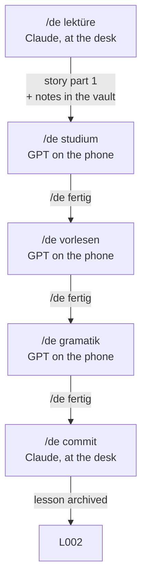

# The lesson cycle

> `{TARGET}` = German · `{KNOWN}` = Spanish · `{LEARNER}` = Pedro → [[Configuration]]

A lesson is a unit of five gated phases: `L001`, `L002`… Each phase is launched
with a command, and each command checks that the previous one has been passed.
That is what turns five tools into a lesson.

There is a sixth command that is not a phase: **`/de fertig`**, which is how the
three phone phases get marked as done → [[Kommando - Fertig]].

## Who does what now

| | Before | Now |
|---|---|---|
| Source of truth | the vault, hand-copied into the prompt | **the vault, read live by Claude** |
| Generates the prompts | the learner, by hand, every 4-6 sessions | **Claude, every lesson** |
| ChatGPT | a tutor with hand-copied memory | **only the voice on the phone** |
| *Learner values* | six lines that went stale silently | **does not exist** |

**That last row is the biggest win.** The recurring cost of the system used to be
keeping a six-line block inside the prompt in sync; forget it and the tutor kept
working at last month's level without saying so. With the prompt generated from
the vault every lesson, there is no copy left to go stale.

## The five phases

### 1. `/de lektüre` — Claude, at the desk

**Spec: [[Kommando - Lektüre]].**

Read the vault: which words are already there, what gets failed, which themes have
been used. Ask for a theme. Write a **story with characters** in two parts and
hand over the first, which is where the new nouns, verbs, adjectives, expressions
and grammar come in. Create the notes with their `lektion` and `cefr`, and store
the story in the lesson note.

If the theme has been used before, that is taken into account so the lesson brings
something new instead of repeating.

### 2. `/de studium` — GPT on the phone

**Spec: [[Kommando - Studium]].** Prompt template: 6512 characters as written,
~1175 for a list of 21 items, **~7690 in total**. Since the mode and marking rules of
September 2026 it is the tightest of the three, not the roomiest.

Check phase 1 is done. Generate the **Studium** GPT prompt with the lesson's
vocabulary, already shuffled and numbered, to be pasted over the existing GPT's
Instructions. Three modes: `Sequenz`, `Frage auf Deutsch`, `Frage auf Spanisch`.

**The 70/30.** The vocabulary in the prompt is not only the lesson's: **70% from
the current lesson, 30% drawn at random from earlier ones.** Without that, every
lesson is a closed bucket and the system learns well and retains badly — the classic
failure of unit-based methods. It costs the learner nothing, because the prompt is
generated here.

That 30% used to be chosen by what had been failed. It is random now, because the
record of what gets failed no longer exists — see below.

**And the random order is shuffled here**, once, and numbered inside the prompt. A
model cannot hold a shuffled list across turns: it loses it and repeats. With the
list fixed, `vorherige` actually works.

### 3. `/de vorlesen` — GPT on the phone

**Spec: [[Kommando - Vorlesen]].** 4926 characters as written, plus the text and the
questions, **~7000 in total**. Still the tightest of the three.

Check phases 1 and 2. Write **part 2 of the story** — same characters, **no new
vocabulary** — and put it literally inside the prompt. The GPT starts by reading
it aloud.

Having the text fixed in the Instructions has an advantage an improvised text did
not: **`noch einmal` repeats exactly the same words**, instead of depending on the
model remembering what it made up.

Then `frag` asks questions about the story, **answered in `{TARGET}`**, with strict
correction of vocabulary, grammar and pronunciation. `nächste` moves on.

> **The text is never written in the chat.** If it is written it gets read, and
> reading is not this phase. Part 1 was already read on a screen; this one is by ear.

### 4. `/de gramatik` — GPT on the phone

**Spec: [[Kommando - Gramatik]].** 4659 characters as written, plus the rule and the
sentences, **~6200 in total**. The roomiest of the three.

Check phases 1, 2 and 3. Generate a GPT with sentences in `{KNOWN}` containing the
lesson's grammar. They get translated aloud; it corrects; repeat; it corrects
again. `nächste` moves to another.

**With an exit after three attempts.** *"Until the sentence comes out right"* can
fail to terminate, and a stuck sentence makes you abandon the session: on the third
attempt it gives the sentence, logs the error and moves on.

### 5. `/de commit` — Claude, at the desk

**Spec: [[Kommando - Commit]].** **All five phases are specified.**

Check all four. Run the vault health check, commit, mark the lesson `closed` and
**archive it, do not delete it**: it is what will tell you, six months from now,
which story taught you `Bahnsteig`.

**The one other way a lesson ends.** A lesson whose phases can no longer be done
would deadlock the cycle: `/de commit` refuses it for missing phases, and
`/de lektüre` refuses to open the next one while it is unclosed. The exit is
**abandoning** it — `closed` gets a date while `phase_5_commit` stays `false`, so
the two endings stay distinguishable and no field has to be invented. The procedure
is in [[Kommando - Lektüre]], because that is the command that hits the wall.
[[L001]] is the worked case, and so far the only one.

## Gates are confirmed by hand

A passed phase is **a box that gets ticked**, and it is ticked by the learner with
`/de fertig` → [[Kommando - Fertig]].

| Phase | Leaves behind | Marked by |
|---|---|---|
| 1. Lektüre | the notes and the story, written into the vault | `/de lektüre` itself |
| 2. Studium | nothing | `/de fertig`, after one question: `Sequenz` does not count |
| 3. Vorlesen | nothing | `/de fertig` |
| 4. Gramatik | nothing | `/de fertig` |
| 5. Commit | the closed lesson and the commit | `/de commit` itself |

### What this replaced, on 2026-09-17

Until that date each phone phase ended by writing a **closing block** in the chat, a
Make Action mailed it, and it was pasted back at the start of the next command. The
block was the evidence *and* the data path: it carried every mistake into the vault,
where it moved `status`, raised `error_count` and dated `last_error`. From that came
`Schwachstellen`, the revision queue, and the priority order of the Studium 30%.

All of it is gone: the Action, the block, the error types, the three fields, and the
two views that read them — `Schwachstellen` and `Nicht gesprochen`.

**What was bought.** A phase now ends by saying so, in one line, to Claude. Nothing
is parsed, nothing is pasted, no mail leaves the phone, and no webhook credential sits
in four GPTs. The three prompts lost about 900 characters each of block rules, which
went back into material.

**What was sold.** Item-level mastery. The vault records what was taught and no longer
records what stuck: there is no revision queue, no exit door from one, and no way to
ask which words keep failing. The gate now proves a claim rather than a fact — saying
`/de fertig` without doing the session works, and only costs the person doing it.

**What survives of it.** Three things, all prose rather than fields: the `## Notas` of
each lesson note, the *recurring mistakes* and *seen, not consolidated* sections of
[[Lernprofil]], and one question asked at the start of phases 3 and 4 — *what came out
wrong last time?* Prose does not filter, sort or empty. It is read, by a person, when
the next lesson is written.

## `cefr` and `lektion` are different things

This is the one thing never to confuse:

- **`cefr: A12`** is **the difficulty of the word** on the international scale. It
  is a property of the vocabulary, not of the learner, and it **decides the
  folder**. Twelve closed tokens: `A11 A12 A21 A22 B11 B12 B21 B22 C11 C12 C21 C22`.
- **`lektion: L001`** is **when it entered the vault**. A field, never a folder:
  the sequence has no ceiling, and one folder per lesson would be fifty
  directories of a dozen words a year.

There is no `level` field any more. Having one meant two things called level, and
that is what broke the views in August. See [[Niveaus]].

**What was lost by removing it, plainly:** the promotion criterion. With lessons,
"progress" comes to mean how many have been done, which is activity and not ability.
Until 2026-09-17 `status: known` and `Schwachstellen` still measured mastery item by
item; since the closing block was retired, nothing does. If a definition of *I have
improved* is wanted three months from now, it has to be built from scratch, and it
will need a field that something actually writes.

## What this cycle retired

The whole earlier "modes" architecture — `Modi`, `Modus - Hören`,
`Modus - Wiederholung` and `Export - Wiederholung` — was deleted on 2026-09-07,
once all five phases were specified. `Studium` does the drilling with fresh data
and no file to regenerate; `Vorlesen` replaces the listening mode and improves on
it, because the text is fixed.

**[[Modus - Sprechen]] survives**, outside the cycle. Free conversation while
walking is none of the five phases and is the only thing that is genuinely
conversation. It stays a permanent GPT with its own prompt — and since 2026-09-17 it
emits no block either: whatever is worth keeping from a walk gets dictated to Claude
afterwards, or it is lost, which for a conversation is an acceptable price.

## The health check lives in phase 5

`/de commit` is the only moment in the cycle that looks at the whole vault **after
everything has happened**, so it is where the failures that raise no error get
caught: invalid `cefr` tokens, folders that do not match their field, broken links,
`.base` files that do not parse, frontmatter that never closes — and the one number
left, `Ohne Beispiel` growing. Detail in [[Kommando - Commit]].

## The prompts are saved

All three generated prompts go inside the lesson note, in their `## Prompt - *`
sections. **They are not reproducible**: the Studium shuffle is random, and the
story and the sentences are generated fresh each time. If a GPT behaves oddly, the
exact pasted prompt is the only thing that makes it possible to find out why.

Saving the Vorlesen one does not contradict the transcript rule: the note is
provenance and gets read at the desk, not during the listening session.

## The GPTs

Three of the five phases run on a permanent GPT whose Instructions get overwritten
every lesson; phases 1 and 5 are Claude at the desk and use none. A fourth GPT,
outside the cycle, handles free conversation. Inventory, configuration and the
overwrite rule: [[GPTs]].

## How it is implemented

The commands are a **skill** called `de`, which is only a **router**: it validates
the command, reads the state in `10 - Lektionen/`, checks the gate, and then reads the
specification in `50 - Ressourcen/Kommando - *.md` and follows it. Six commands now:
the five phases plus `fertig`.

**The logic lives in the vault, not in the skill.** To change how the story gets
written or how many words come in, edit [[Kommando - Lektüre]] in Obsidian. That is
consistent with the vault being the source of truth: it is the source of truth for
how the system works, not only for what has been learned.

If a specification does not exist, the skill says so and stops. It does not
improvise a version.

## Status

| Lesson | Theme | Phases | Notes |
|---|---|---|---|
| [[L001]] | `wohnen` | abandoned | reconstructed retroactively, did not follow the flow |
| [[L002]] | `essen-trinken` | 1 of 5 | the first lesson to run the cycle |

**L002 is also the lesson that straddles the change**: its phase 1 ran under the old
rules and its Studium prompt was generated with a block in it. That prompt was
regenerated on 2026-09-17; the one pasted before that date emits a block nobody reads.
